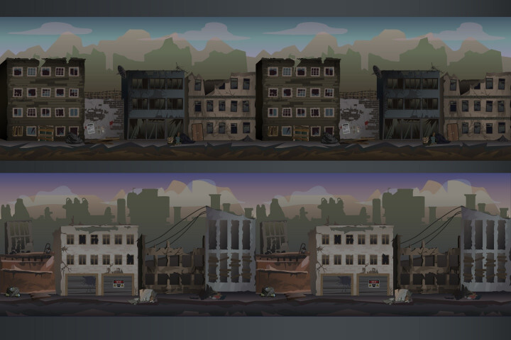
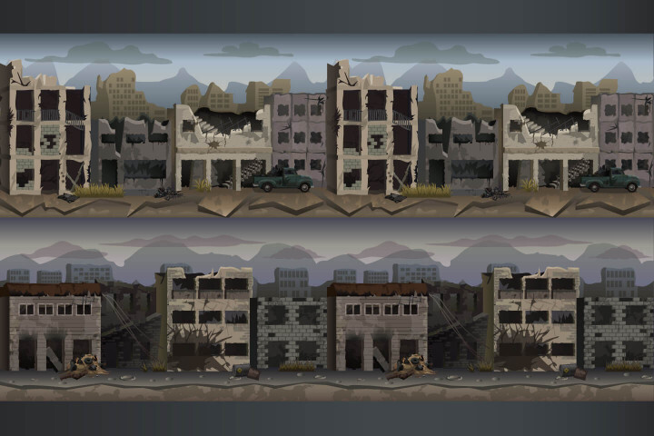
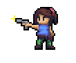
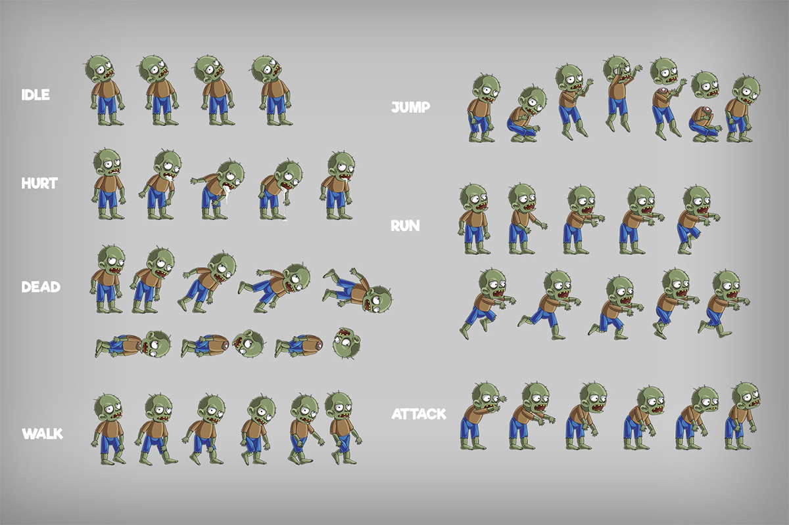
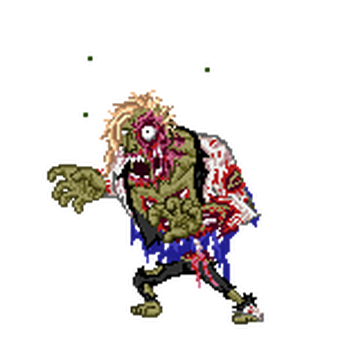
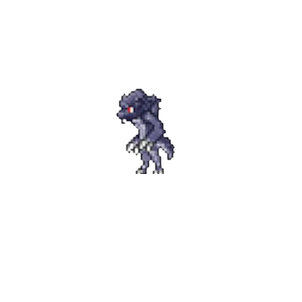
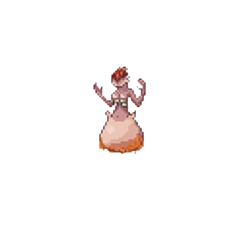
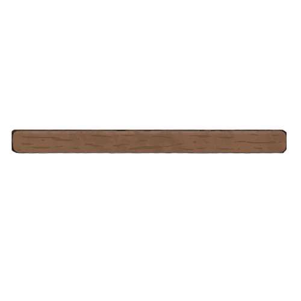
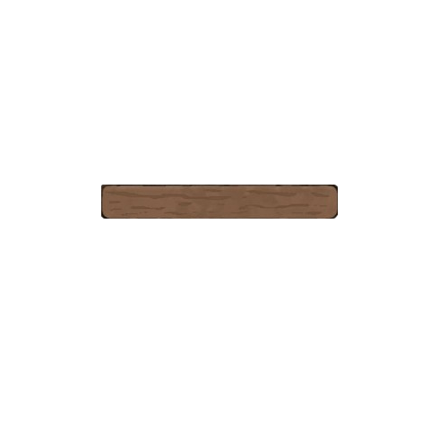
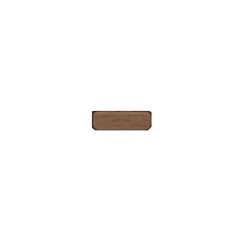

# Apocalyptic Soulmate - Technical Specifications

📖 Table of content

- [Apocalyptic Soulmate - Technical Specifications](#apocalyptic-soulmate---technical-specifications)
  - [I. Overview](#i-overview)
    - [A. Project Introdction](#a-project-introdction)
    - [B. Team Development](#b-team-development)
  - [II. Design](#ii-design)
    - [A. Background](#a-background)
    - [B. Characters](#b-characters)
    - [C. Items](#c-items)
  - [III. Audios](#iii-audios)
  - [IV. Implementation](#iv-implementation)
    - [A. Characters](#a-characters)
    - [B. Items](#b-items)

| | |
| ----- | ----- |
| Author(s) | Grégory PAGNOUX |
| Reviewer(s) | Mathis LEBEL, Séréna BAVAROIS |
| Created on | 21/03/2024 |
| Last updated | 22/03/2024 |
|  |  |

## I. Overview

### A. Project Introdction

You are the last man in the world and you need to escape zombies and find your soulmate that you loose at the beginning of the invasion.
For that, you need to find a door to pass each room and to be in secure place.
Every two levels, you find a boss to earn new equipment like weapons, shield, portals, etc.

Can you find your lost love?

### B. Team Development

| NAME | ROLE | GITHUB | MAIL |
| - | - | - | - |
|    Grégory PAGNOUX | Writter / Ressources Manager | [Grégory PAGNOUX profile](https://github.com/Gregory-Pagnoux) | [gregory.pagnoux@algosup.com](mailto:gregory.pagnoux@algosup.com) |
|    Mathis LEBEL | Developper Manager | [Mathis LEBEL profile](https://github.com/mathislebel)|  [mathis.lebel@algosup.com](mailto:mathis.lebel@algosup.com) |
|    Séréna BAVAROIS | Designer Manager | [Séréna BAVAROIS profile](https://github.com/NanaChocolat)|  [serena.bavarois@algosup.com](mailto:gregory.pagnoux@algosup.com) |

## II. Design

### A. Background

We need a city ruins image in the cartoon design.

### B. Characters

**Main**

We need a human character in different posture in the cartoon design :

- doesn't move
- walk right
- walk left
- jump
- punch

**Zombies**

We need a zombie character in different posture in the cartoon design :

- walk right
- walk left
- lying

**Bosses**

We need a big zombie character in the cartoon design in unique posture :

- doesn't move

### C. Items

**Platforms**

Platforms are long, medium, and short planks.

**syringes**

Thanks this item, you can gain som power, like speed or shield.

**Teleporters**

Teleporters are blue circles with brown embroidery

## III. Audios

We need three differents audios for the game :

- background of level : [n°1](https://universal-soundbank.com/sounds/13826.mp3)
- background of boss : [n°1](https://universal-soundbank.com/sounds/13821.mp3) / [n°2](https://universal-soundbank.com/sounds/13825.mp3
)
- death for zombies : [n°1](https://universal-soundbank.com/sounds/9680.mp3)

*All audios are take on the [Universal Sounbank](https://universal-soundbank.com) site.*

## IV. Implementation

We have different classes to implement the game :

### A. Characters

- for general characters (main, zombies, bosses)
  - name
  - speed
  - life
  - damage

- for the main character
  - inventory

- for zombies characters
  - name

- for bosses characters
  - name
  - ability

### B. Items

- for platforms
  - name
  - position

- for inventory
  - index
  - name

- for weapons (iron bar, knife, robot, gun)
  - name
  - damage

- for shield
  - defense

- for teleporter
  - index
  - position
